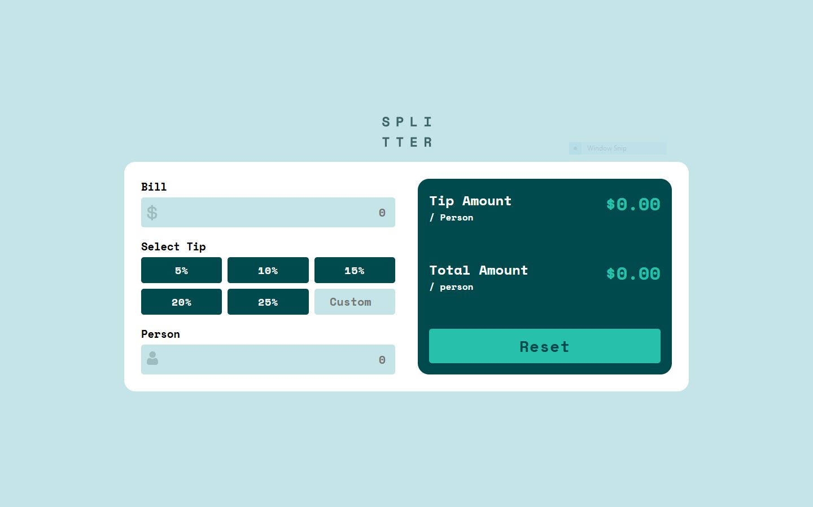

## A sleek and responsive Tip Calculator built using HTML, CSS, and JavaScript. This app allows users to quickly calculate the tip amount and total cost per person based on the bill and number of people.

#### 🔗 Live Demo: tip-calculator-app-mfa.vercel.app

## ✨ Features

### 💸 Real-time tip calculation

### 👥 Per person total display

### ❗ Error handling for invalid inputs (e.g., empty or zero people)

### 🎨 Beautiful, clean layout with a modern and intuitive design

### 📱 Responsive UI for mobile and desktop views

## 🛠️ Technologies Used

### HTML5 – for semantic and accessible markup

### CSS3 – for custom styling and layout

### JavaScript – for dynamic functionality and input validation

📷 Screenshot

